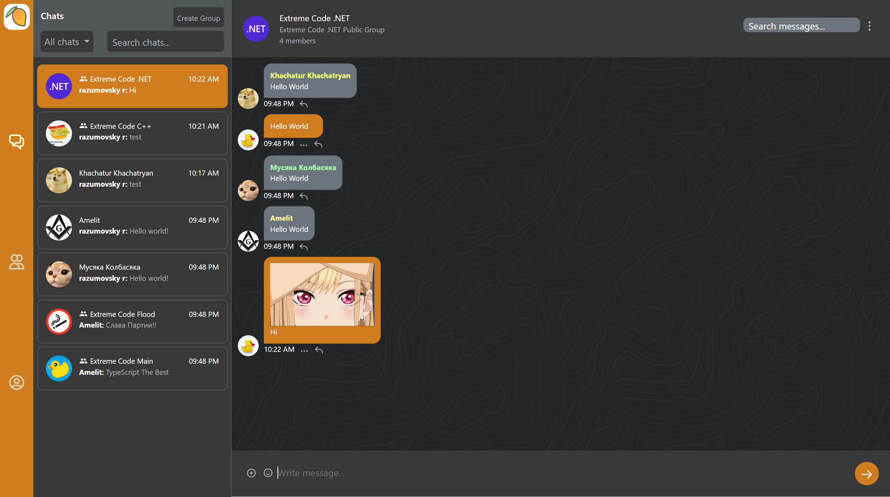
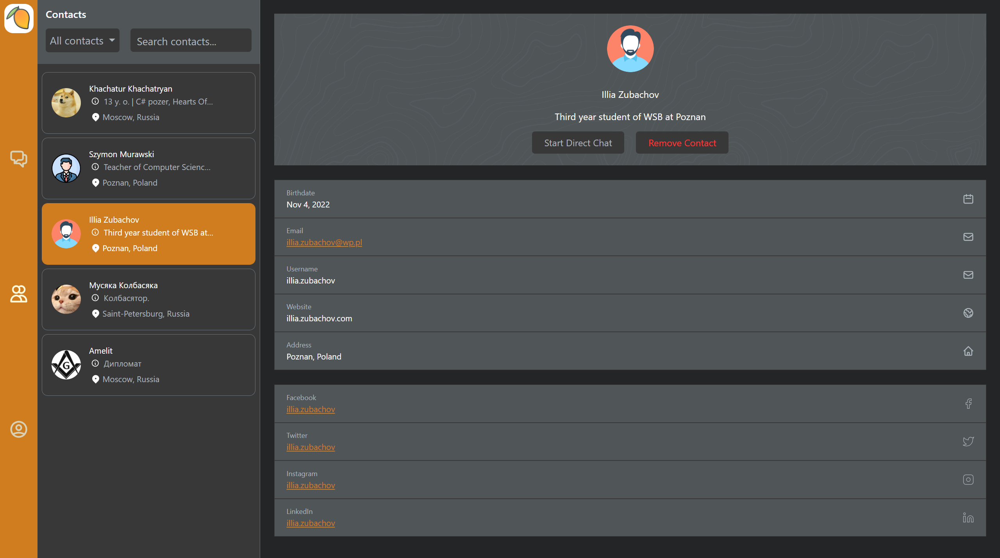
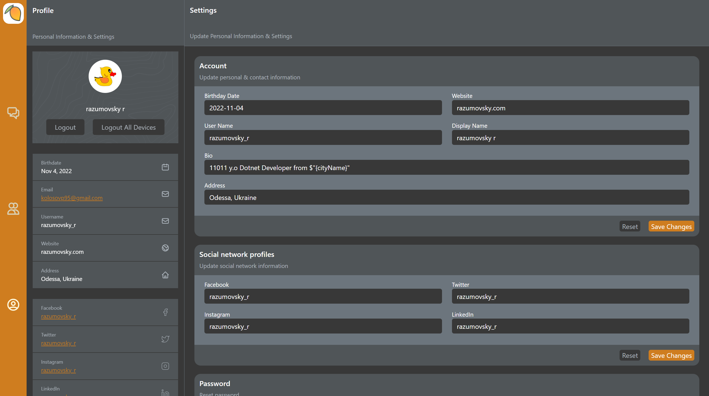

# Mango Messenger Web API

  

## Description

Mango Messenger is an opensource instant messaging system that implemented using .NET and Angular frameworks.
In general, this project is considered to be a bachelor's degree project.
Bachelor's project has been successfully completed by the team of three students on 10-02-2022.
However, it is worth to continue progress on the project pursuing another predefined goals.

**How it works (v1)**: https://www.youtube.com/watch?v=3lh3we1DrEY

## Main goals of the project

- Implementation of simple, maintainable, safe and scalable code base following the KISS and YAGNI software development
  principles.
- To maintain the code quality using static code analyzers such as ReSharper, SonarQube where SonarQube analysis is a
  part of the CI/CD pipeline with further publication of the QualityGate results.
- To use proper IDE configurations and style rules, it is about editor config and StyleCop extensions.
- To maintain high (> 70%) code coverage using unit tests, integration tests and E2E tests with ongoing publication of
  the coverage report to the Azure DevOps workflow statistics.
- To implement layered architecture where each layers is a separate project responsible for single part of the
  application. For example, the Domain layer is responsible for the business logic and validates itself.
- To implement productive, quick and safe development cycle. It is mainly about organization of the CI/CD
  process using Azure DevOps and Azure pipelines so that each pull request to be validated and tested. Moreover, the
  CD (Continuous Deployment) must be confirmed manually be designated person.
- To implement E2E tests inside CI/CD pipelines using Docker Compose and Postman.
- To implement IaaC using Hashicorp Terraform and applying this infrastructure on behalf of CI/CD pipelines.
- To implement cryptographic protocol that allows End-to-end (E2E) encryption using confidential clients.

## Cryptography

- Run CNG Diffie-Hellman
  Handshake: 
- Run OpenSSL Diffie-Hellman
  Handshake: 

## Screenshots

### Chats

### Contacts

### Settings

## Build and run the project

### Prerequisites

Obligatory required software:

- **.NET SDK 6.0.202 or later:** https://dotnet.microsoft.com/en-us/download
- **NVM for windows:** https://github.com/coreybutler/nvm-windows
- **Azure storage explorer**: https://azure.microsoft.com/en-us/products/storage/storage-explorer
- **Azure data studio**: https://azure.microsoft.com/en-us/products/data-studio
- **Docker:** https://docs.docker.com/desktop/windows/install
- **Angular:** `13.3.5`
- **Angular CLI:** `13.3.4`
- **NodeJS:** `16.13.1`
- **NPM:** `8.1.2`
- **Code Editor or IDE:** Visual studio, Visual studio code, Rider
- **For Visual studio code:** [ESlint](https://marketplace.visualstudio.com/items?itemName=dbaeumer.vscode-eslint)
  and [Prettier](https://marketplace.visualstudio.com/items?itemName=esbenp.prettier-vscode) plugins (also included in
  the workspace recommendations)

### Run in debug mode

Perform the following steps:

- Install NVM: https://github.com/coreybutler/nvm-windows
- Install NodeJS 14.17.3 using NVM via PowerShell as Administrator: `nvm install 16.13.1`
- Use NodeJS 14.17.3 using NVM via PowerShell as Administrator: `nvm use 16.13.1`
- Check NodeJS installed properly (should be 16.13.1): `node -v`
- Check NPM installed properly (should be 8.1.2): `npm -v`
- Go to the project folder: `cd MangoAPI.Client`
- Restore node modules: `npm ci`
- Install Angular CLI globally: `npm install -g @angular/cli@13.3.4`
- Open PowerShell as Administrator and type: `Set-ExecutionPolicy -ExecutionPolicy RemoteSigned`
- Check that Angular CLI installed properly: `ng version`
- Build project for development using Angular CLI: `ng build --aot --configuration development`
- NOTE: for production command is: `ng build --aot --configuration production`
- Restore .NET packages: `cd .. & dotnet restore`
- Run the .NET web API: `dotnet run`
- Navigate to the swagger: `https://localhost:5001/swagger/index.html`
- Navigate to the root url: `https://localhost:5001/app`

In case of localhost HTTPS certificate issues: https://stackoverflow.com/a/67182991

### Run integration tests

- Run MsSQL database
  container: `docker run -e SA_PASSWORD=x2yiJt!Fs -e ACCEPT_EULA=y --name mango-mssql-db --hostname mango-mssql-db -p 1433:1433 -d mcr.microsoft.com/mssql/server:2019-latest`
- Install Azurite: https://learn.microsoft.com/en-us/azure/storage/common/storage-use-azurite?tabs=npm
    - `npm install -g azurite`
    - `azurite --silent --location c:\azurite --debug c:\azurite\debug.log`
    - Upload mock images from `./img/seed_images/*` to local Azure Blob container

## Technology stack

- **SDK:** `.NET 6`
- **Frameworks:** `ASP .NET`, `Angular`
- **Persistence:**
    - Database: `MS SQL Server`
    - ORM: `Entity Framework Core 6.0`
    - Storage: `Azure Blob Storage`
- **Authorization:** `ASP .NET Identity Core`, `JWT Bearer`
- **Business Logic:**
    - `MediatR`
    - `Fluent Validation`
    - `AutoMapper`
- **Presentation:**
    - API Documentation: `OpenAPI (Swagger)`
    - Realtime Communication: `SignalR`
    - Frontend Development: `Angular`
- **Unit and Integration Testing:** `XUnit`, `FluentAssertions`
- **Code Quality Tools:** `SonarQube`
- **Containerization:** `Docker`
- **Continuous Integration:** `Azure Pipelines`, `GitHub Actions`
- **Continuous Deployment:** `Azure Pipelines`, `GitHub Actions`, `Azure DevOps`, `Azure App Service`
- **Programming languages:** `C#`, `SQL`, `TypeScript`
- **Tools & IDE:** `Visual Studio`, `Rider`, `VS Code`, `WebStorm`, `SMSS`, `Postman`

## Versions

- **.NET SDK:** `.NET 6.0.202`
- **Angular:** `13.3.5`
- **Angular CLI:** `13.3.4`
- **NodeJS:** `16.13.1`
- **NPM:** `8.1.2`

## Tasks management

The opened tasks and issues to be organized an handled as follows:

- Each task has an assigned number in the format `MANGO-ID`
- Active tasks are available on the Trello board: https://trello.com/b/Z7IlfrRb/mango-messenger-trello
- Each task branch is based on the actual `develop` branch and pull requested there on complete

## Git flow

Version control to be organized as follows:

- Fork this repository
- Clone this repository using `git clone https://github.com/${{ username }}/MangoMessengerAPI.git`
- If repository is cloned already then pull last changes from `develop` using
    - `git checkout develop`
    - `git pull`
- Create new branch based on `develop` with name according to `MANGO-ID` of the task
- Solve the task
- Create pull request to `develop`

## Commit messages

- In case of bug fix, example of commit message `bugfix: some bug fixed`
- In case of feature, example of commit message `feature: some new functionality added`
- In case of refactor, example of commit message `refactor: some code part refactored`

## Useful Links

- Trello: https://trello.com/b/Z7IlfrRb/mango-messenger-trello
- Database diagram: https://dbdiagram.io/d/60d66a13dd6a597148203e6b
- How to exclude project from coverage: https://codyanhorn.tech/blog/excluding-your-net-test-project-from-code-coverage

## Logo Attribution

Icons made by <a href="https://www.freepik.com" title="Freepik">Freepik</a> from <a href="https://www.flaticon.com/" title="Flaticon">www.flaticon.com</a>

